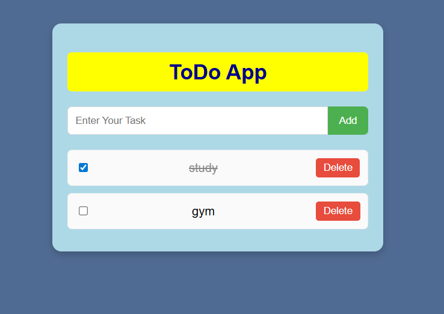

# 📝 ToDo App

A simple To-Do List web app built with **HTML, CSS, and JavaScript**.  
You can add tasks, mark them as completed, and delete them when done.

---

## 🚀 Features
- Add new tasks easily
- Mark tasks as **completed** using a checkbox
- Delete tasks with a single click
-Task gets styled differently if marked completed
- Clean and responsive UI

---

## 📂 Project Structure
├── index.html # Main HTML file
├── style.css # Styling for the app

---

## ▶️ How to Run
1. Visit the live demo hosted on **GitHub Pages**:  
   👉 [Live App Link](https://soumyag001.github.io/TO-DOLIST/ )  
2. Start adding your tasks ✅

---

## 📸 Screenshot

Here’s how the ToDo App looks:

